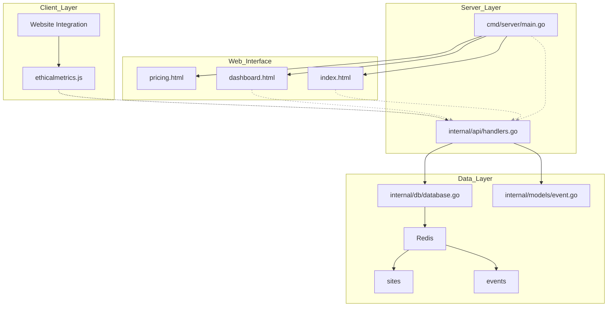
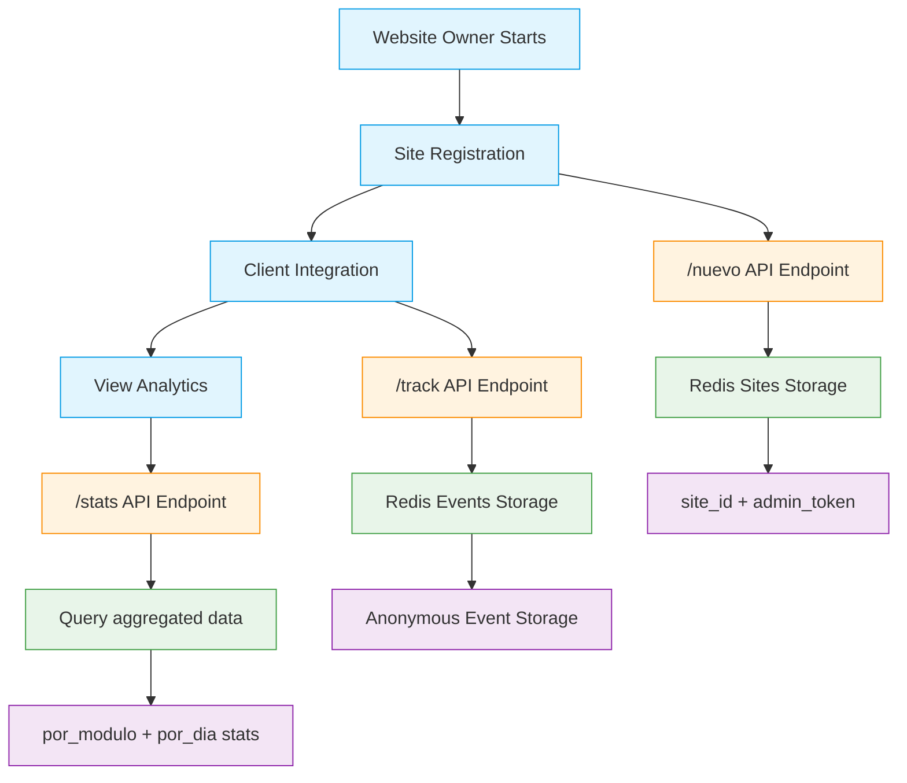
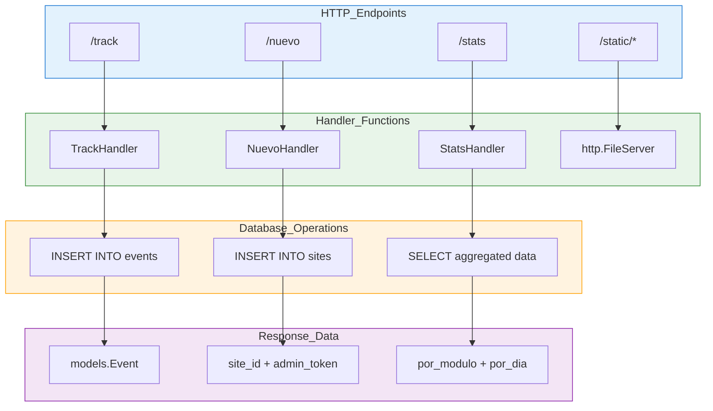

# EthicalMetrics

[](https://deepwiki.com/livrasand/EthicalMetrics) [](https://ethicalmetrics.onrender.com) [](https://golang.org/dl/) [](https://hub.docker.com) [](https://goreportcard.com/report/github.com/livrasand/EthicalMetrics) [](https://codecov.io/gh/livrasand/EthicalMetrics)

**EthicalMetrics** is a next-generation web analytics platform built with one radical goal:  
**protecting your users' privacy while delivering meaningful insights.**

No cookies. No fingerprinting. No personal data. No compromises.

> **Perfect for privacy-first projects, sensitive applications, decentralized platforms, or any product that truly values user trust.**

---

## Why EthicalMetrics?

- **True Anonymity by Design**  
  No IP collection. No device fingerprinting. No persistent IDs.  
  100% anonymous, with no way to track individual users — by default.

- **Self-Hosted, Zero External Dependencies**  
  No third-party scripts, CDNs, or vendors. You own your data.

- **End-to-End Encryption**  
  Data is protected at rest using Redis. Built-in, not bolted on.

- **Core, Actionable Metrics**  
  Track visits, module usage, performance, events, and engagement — not people.

- **Lightweight & Easy to Use**  
  A single vanilla JS snippet. No frameworks. No bloat.  
  Ethical by default — even without configuration.

- **Flexible Open API**  
  Send custom events and modules programmatically with minimal overhead.

- **Private Dashboards per Site**  
  Each site has its own dashboard secured with token-based access.

- **Portable by Nature**  
  Works on VPS, Docker, Render, or local environments. No lock-in.

EthicalMetrics exists to prove that **analytics can be useful without being creepy.**  
👉 [Read the Ethical Analytics Manifesto in `FUNDAMENTALS.md`](./FUNDAMENTALS.md)

EthicalMetrics is growing fast — without compromising ethics.  
👉 [Check out the roadmap here](./ROADMAP.md)

---

## Architecture Overview

Understanding how EthicalMetrics works internally helps you make the most of its privacy-first approach. The following diagrams illustrate the system's core components and data flow.

### System Architecture

The complete EthicalMetrics system consists of four main layers working together:



### User Workflow

EthicalMetrics follows a simple three-stage process from registration to analytics:



### API Endpoints

The system exposes three main API endpoints that handle all core functionality:



---

## Getting Started

1. Register your site with one clic at:

```
https://ethicalmetrics.onrender.com
````

2. Get your `site_id` and `admin_token`.

3. Add the tracking script to your HTML:

```html
<script src="https://ethicalmetrics.onrender.com/ethicalmetrics.js?id=YOUR_SITE_ID"></script>
```

**Ultra-simple banner customization:**  
You can easily customize the consent banner by adding `data-*` attributes to the script tag:

```html
<script
  src="https://ethicalmetrics.onrender.com/ethicalmetrics.js?id=YOUR_SITE_ID"
  data-banner-bg="#222"
  data-banner-color="#fff"
  data-banner-btn-bg="#4a90e2"
  data-banner-btn-color="#fff"
  data-banner-text="We respect your privacy. DNT is enabled. Only if you accept, we collect anonymous analytics."
  data-banner-btn-text="Accept"
></script>
```

Change colors and text as you wish — no coding required!

4. Optionally, define a custom module for richer context:

```html
<body data-modulo="home">
  ...
  <script src="https://ethicalmetrics.onrender.com/ethicalmetrics.js?id=YOUR_SITE_ID"></script>
</body>
```

5. Access your private dashboard:

```
https://ethicalmetrics.onrender.com/dashboard.html?site=YOUR_SITE_ID&token=YOUR_ADMIN_TOKEN
```

---

## Experimental & Evolving

This is a living project under active development.
We **welcome contributors**, audits, and ideas from the community.

* 🌱 Open issues for feedback or ideas
* 🔍 Fork or inspect the code — transparency is key
* 🛠️ Help us build the most **trustworthy** analytics platform on the web

### Polyrepo

EthicalMetrics is organized into multiple specialized repositories under a decoupled architecture. This allows contributors to contribute in a segmented manner, based on their interests or skills.

#### Backend
Main repository containing the server logic, API, and database:

→ [`github.com/livrasand/EthicalMetrics`](https://github.com/livrasand/EthicalMetrics)

#### Frontend
**Modular, decoupled static frontend with dynamic loading from CDN**, based on reusable HTML components and lightweight JavaScript for SPA-like navigation:

→ [`github.com/EthicalMetrics/website`](https://github.com/EthicalMetrics/website)

This frontend is distributed through [jsDelivr](https://www.jsdelivr.com/) for instant loading and real-time integration without external dependencies. You can contribute new components, visual improvements, or interactive features.

---

## Get Involved

Made with 💚 by [@livrasand](https://github.com/livrasand).
Want to collaborate, contribute, or ask something?

→ [Open an issue](https://github.com/livrasand/EthicalMetrics/issues)
→ [Submit a pull request](https://github.com/livrasand/EthicalMetrics/pulls)

---

**🛡️ Ethical by design. Anonymous by default. Metrics with ethics. Do EthicalMetrics!**

## License

This project is available under a dual license model:

- **GNU GPL v3** for personal, educational, or compatible open source use.
- **EthicalMetrics Commercial License** for commercial, SaaS, or proprietary products.

For a commercial license, see [`LICENSE-COMMERCIAL.md`](./LICENSE-COMMERCIAL.md).